# Using this IdP from an MCP server

Input document for implementing an MCP server that authenticates against
`idp-auth-server`.

## Role split

In MCP authorization, the **MCP server is an OAuth 2.0 resource server**. It
never registers itself and never talks to `/token`. The **MCP client** is the
OAuth client: it discovers the IdP, self-registers via dynamic client
registration, and runs the authorization code + PKCE flow. The MCP server only
advertises where to authenticate and validates the resulting access token.

```mermaid
sequenceDiagram
  participant C as MCP client
  participant S as MCP server (resource server)
  participant I as IdP (idp-auth-server)

  C->>S: MCP request without a token
  S-->>C: 401 + WWW-Authenticate: Bearer resource_metadata="..."
  C->>S: GET /.well-known/oauth-protected-resource
  S-->>C: { authorization_servers: ["<issuer>"] }
  C->>I: GET /.well-known/oauth-authorization-server
  I-->>C: metadata incl. registration_endpoint
  C->>I: POST /register (token_endpoint_auth_method "none")
  I-->>C: client_id (no secret)
  C->>I: GET /authorize (PKCE S256) then POST /token
  I-->>C: access token (JWT, RS256)
  C->>S: MCP request + Authorization: Bearer <token>
  S->>I: GET /.well-known/jwks.json (cached)
  S-->>C: MCP response
```



## What the IdP gives you

Assuming `IDP_EXTERNAL_URL=http://127.0.0.1:5001`:

| Endpoint | Purpose |
| --- | --- |
| `/.well-known/oauth-authorization-server` | RFC 8414 metadata — what the MCP client discovers |
| `/.well-known/openid-configuration` | Same metadata, OIDC flavour |
| `/.well-known/jwks.json` | RS256 public key (`kid: k0`) for token validation |
| `/register` | RFC 7591 dynamic client registration (open, no initial access token) |
| `/authorize`, `/token` | Authorization code flow, PKCE `S256` supported |

Access tokens are RS256 JWTs with `iss` set to the IdP's external URL, a
`token_use: "access"` claim, and a `scope` claim.

## What the MCP server must implement

### 1. Protected resource metadata (RFC 9728)

Serve `GET /.well-known/oauth-protected-resource` on the MCP server itself:

```json
{
  "resource": "https://mcp.example.com",
  "authorization_servers": ["http://127.0.0.1:5001"],
  "bearer_methods_supported": ["header"],
  "scopes_supported": ["openid", "profile", "email"]
}
```

This is the MCP server's own endpoint — the IdP does not provide it.

### 2. Challenge unauthenticated requests

Any MCP request without a valid token gets `401` and a `WWW-Authenticate`
header pointing at that metadata document:

```http
HTTP/1.1 401 Unauthorized
WWW-Authenticate: Bearer resource_metadata="https://mcp.example.com/.well-known/oauth-protected-resource"
```

The MCP client uses this to bootstrap discovery and registration with no
out-of-band configuration.

### 3. Validate the access token

On every request, take the bearer token and:

1. Fetch and cache the JWKS from `<issuer>/.well-known/jwks.json`.
2. Verify the RS256 signature and reject any other `alg`.
3. Check `iss` equals the configured issuer exactly.
4. Check `exp` (and `nbf`/`iat` if present).
5. Check `aud` includes this MCP server's resource identifier — **see the
   caveat below**.
6. Check the `scope` claim covers what the requested tool or resource needs.

Never forward a client's token to another upstream service, and never accept a
token that was not issued for you.

## Caveats with the current IdP

These are real limitations of `idp-auth-server` today, not of the MCP spec.

- **No audience binding.** The IdP does not implement RFC 8707 `resource`
  parameters. Access tokens are minted with `aud` set to
  `<issuer>/userinfo` plus anything listed in `EXTRA_AUDIENCES`. To get a
  usable `aud` check, start the IdP with
  `EXTRA_AUDIENCES=https://mcp.example.com` and verify that value; until proper
  audience binding exists, a token minted for one relying party is accepted by
  any resource server that trusts this issuer.
- **Registration is not enforced.** `/authorize` and `/token` still accept any
  `client_id` and `redirect_uri`. A token therefore does not prove the client
  went through dynamic client registration.
- **Registrations are in-memory.** They are lost when the IdP restarts, so a
  client may need to re-register. Handle a `401` after a restart by
  re-running discovery and registration rather than failing hard.
- **Authentication is fake.** Any username with the password `valid` succeeds.
  Development and demo use only.

## Configuration checklist for the MCP server

- `ISSUER` — e.g. `http://127.0.0.1:5001`, matched exactly against `iss`.
- `RESOURCE_IDENTIFIER` — the MCP server's own canonical HTTPS URL, published
  as `resource` and expected in `aud`.
- JWKS cache with a bounded TTL and refresh on unknown `kid`.
- Required scopes per tool or resource.

## Related

- [`idp-auth-server/README.md`](../idp-auth-server/README.md#dynamic-client-registration)
  — registration metadata, defaults, and a `curl` example.
